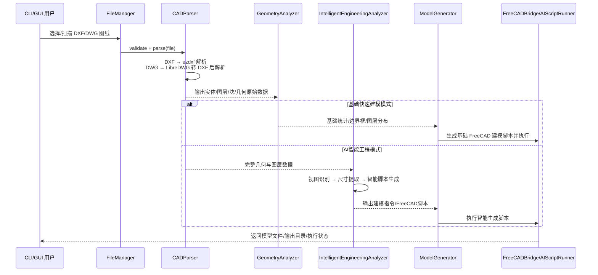

# CAD 图纸 3D 建模系统

版本：1.0.0
变更日期：2026-05-13
影响范围：配置加载、安全日志、FreeCAD 自动发现、CAD 预览输出、依赖元数据、开发文档

本项目用于将 DXF/DWG 二维 CAD 工程图解析为结构化几何数据，并通过 FreeCAD Python API 生成 STEP、STL、FCStd 等三维模型。系统提供 CLI、Tkinter GUI、批处理流水线和智能分析模块，适合毕业设计演示、批量图纸验证和后续算法扩展。

## 技术栈

| 领域     | 技术                           | 说明                                |
| ------ | ---------------------------- | --------------------------------- |
| 语言     | Python 3.10+                 | 推荐 Conda 环境 `cad_study`           |
| CAD 解析 | ezdxf                        | 读取 DXF，提取线、圆、圆弧、多段线、文本、块等实体       |
| DWG 转换 | LibreDWG                     | 通过 `dwg2dxf.exe` 将 DWG 转换为 DXF    |
| 几何分析   | Shapely、NumPy、scikit-learn   | 空间关系、数值计算、DBSCAN 视图聚类             |
| AI 接口  | OpenAI SDK + DeepSeek V4 Pro | API Key 从环境变量或 `.env` 读取          |
| 3D 建模  | FreeCAD Python API           | direct 或 subprocess 模式执行建模脚本      |
| GUI    | Tkinter + matplotlib         | 文件列表、预览、参数设置和进度反馈                 |
| 配置     | YAML + `.env`                | 环境变量 > `.env` > YAML 字面值          |
| 日志     | Python logging               | 自动脱敏 `sk-*`、`api_key=*`、`token=*` |

## 目录结构

```text
E:\Code\CAD
├── cad_cli.py                    # CLI 入口
├── gui_example.py                # Tkinter GUI 入口
├── process_my_cad.py             # 单文件处理示例
├── run_ai_script.py              # AI/FreeCAD 脚本运行器
├── config/
│   ├── config.yaml               # 本地配置，使用 ${VAR} 占位符
│   └── config.example.yaml       # 配置模板
├── docs/
│   ├── api/index.md              # API 与模块说明
│   └── guides/
│       ├── configuration.md      # 配置与密钥管理
│       ├── getting_started.md    # 快速开始
│       ├── gui_guide.md          # GUI 使用说明
│       └── conda_setup.md        # Conda 环境说明
├── src/
│   ├── cad_parser/               # CAD 解析与预览
│   ├── geometry_analyzer/        # 几何分析
│   ├── intelligent_analyzer/     # 视图识别、尺寸提取、建模指令生成
│   ├── model_generator/          # FreeCAD 建模和脚本执行
│   ├── batch_processor/          # 文件扫描、单文件处理、批处理
│   └── utils/                    # 配置、日志、Result、缓存
├── tests/unit/                   # 单元测试
├── examples/cad_files/           # 示例 DXF/DWG
└── examples/output/              # 运行输出，已加入忽略规则
```

## 快速开始

```powershell
cd E:\Code\CAD
conda activate cad_study
python -m pip install -r requirements.txt
```

复制并填写环境变量模板：

```powershell
Copy-Item .env.example .env
```

`.env` 示例：

```env
DEEPSEEK_API_KEY=your-deepseek-api-key-here
LIBREDWG_PATH=D:\Code\libredwg-0.13.4.8160-win64
FREECAD_BIN_PATH=D:\FreeCAD 1.0\bin
```

运行测试：

```powershell
D:\anaconda3\envs\cad_study\python.exe -m pytest tests\unit -q
```

运行 GUI：

```powershell
D:\anaconda3\envs\cad_study\python.exe gui_example.py
```

运行 CLI：

```powershell
D:\anaconda3\envs\cad_study\python.exe cad_cli.py --list
D:\anaconda3\envs\cad_study\python.exe cad_cli.py --file examples/cad_files/sample.dxf
D:\anaconda3\envs\cad_study\python.exe cad_cli.py --file examples/cad_files/sample.dxf --intelligent
```

## 核心流程



## 已完成的重要优化

| 类型 | 文件                                                               | 说明                                                               | 影响            |
| -- | ---------------------------------------------------------------- | ---------------------------------------------------------------- | ------------- |
| 安全 | `config/config.yaml`、`config/config.example.yaml`、`.env.example` | API Key 改为 `${DEEPSEEK_API_KEY}`，真实密钥放入 `.env`                   | 降低密钥误提交风险     |
| 安全 | `src/utils/logging.py`                                           | 新增 `SensitiveDataFilter`，日志中自动脱敏常见密钥格式                           | 降低日志泄露风险      |
| 配置 | `src/utils/config.py`                                            | 支持 `.env` 和 `${VAR}` 解析，优先级为环境变量 > `.env` > YAML 字面值             | 配置更适合多环境部署    |
| 架构 | `src/model_generator/freecad_bridge.py`                          | FreeCAD 路径从硬编码候选改为动态扫描和 `.env` 配置                                | 减少机器绑定        |
| 架构 | `src/utils/result.py`                                            | 新增泛型 `Result[T]`，提供 `ok/fail/unwrap_or/map`                      | 统一错误返回风格      |
| 工程 | `pyproject.toml`                                                 | 新增项目元数据、依赖范围、ruff/mypy/pytest/coverage 配置                        | 便于构建和质量检查     |
| 工程 | `.gitignore`                                                     | 忽略 `.env`、输出、缓存和模型文件，保留 `.env.example`                           | 减少敏感和产物污染     |
| 修复 | `src/cad_parser/parser.py`、`gui_example.py`                      | 预览图保存到 `examples/output/<图纸名>/<图纸名>_preview.png`，移除 `plt.show()` | 支持无头环境和稳定预览缓存 |

## 风险与注意事项

- `.env` 不应提交；`.env.example` 必须提交，供新开发者复制。
- `SensitiveDataFilter` 只覆盖常见密钥模式，不能替代最小化日志策略。
- AI/FreeCAD 脚本仍包含 `exec()` 执行路径，应继续推进沙箱化、白名单 API 和输出目录限制。
- FreeCAD 自动扫描目前主要覆盖 Windows 常见安装路径，非 Windows 环境建议显式设置 `FREECAD_BIN_PATH`。
- `pyproject.toml` 和 `requirements.txt` 已保持核心依赖方向一致，后续新增依赖时应同步更新两处。

更多变更记录见 [CHANGELOG.md](CHANGELOG.md)，配置说明见 [docs/guides/configuration.md](docs/guides/configuration.md)。
